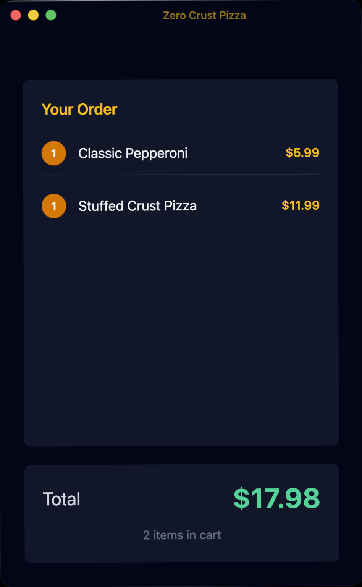

<div align="center">
  

  # Zero Crust POS Simulator

  A virtualized dual-head point-of-sale system built with Electron, demonstrating enterprise-grade architecture patterns for high-volume retail environments.

  [](https://www.electronjs.org/)
  [](https://react.dev/)
  [](https://www.typescriptlang.org/)
  [](https://tailwindcss.com/)
  [](https://vitejs.dev/)
  [](https://opensource.org/licenses/MIT)

</div>

## Downloads

| Platform | Download |
|----------|----------|
| macOS (Apple Silicon) | [Zero.Crust-darwin-arm64-1.0.0.zip](https://github.com/cameronrye/zero-crust/releases/download/v1.0.0/Zero.Crust-darwin-arm64-1.0.0.zip) |
| macOS (Intel) | [Zero.Crust-darwin-x64-1.0.0.zip](https://github.com/cameronrye/zero-crust/releases/download/v1.0.0/Zero.Crust-darwin-x64-1.0.0.zip) |
| Windows | [Zero.Crust-1.0.0.Setup.exe](https://github.com/cameronrye/zero-crust/releases/download/v1.0.0/Zero.Crust-1.0.0.Setup.exe) |
| Linux (Debian/Ubuntu) | [zero-crust_1.0.0_amd64.deb](https://github.com/cameronrye/zero-crust/releases/download/v1.0.0/zero-crust_1.0.0_amd64.deb) |
| Linux (Fedora/RHEL) | [zero-crust-1.0.0-1.x86_64.rpm](https://github.com/cameronrye/zero-crust/releases/download/v1.0.0/zero-crust-1.0.0-1.x86_64.rpm) |

[View all releases](https://github.com/cameronrye/zero-crust/releases)

## Overview

Zero Crust is a POS simulator designed to explore and validate architectural patterns for quick-service restaurant operations. It features a dual-window architecture with synchronized state management, simulating separate cashier and customer-facing displays while maintaining data consistency across both. This is a reference implementation for studying distributed state management, secure IPC communication, and offline-first design patterns.

## Screenshots

<table>
  <tr>
    <td></td>
    <td></td>
  </tr>
</table>


## Key Features

- **Dual-Head Display Simulation** - Separate cashier and customer windows with real-time synchronization
- **Offline-First Architecture** - Local data persistence demonstrates continuous operation patterns
- **Integer-Only Currency** - All monetary values stored in cents to prevent floating-point errors
- **Command Pattern IPC** - Type-safe, auditable command system for all state mutations
- **Simulated Payment Processing** - Models async payment flows with retry logic and error handling
- **Transaction Recovery** - Automatic detection and voiding of pending transactions on restart
- **Demo Loop** - Auto-generates realistic order patterns for continuous operation

## Architecture

### Process Model

```
+-------------------+          +-------------------+
|  Cashier Window   |          |  Customer Window  |
|   (Renderer)      |          |   (Renderer)      |
+--------+----------+          +----------+--------+
         |                                |
         |    contextBridge (IPC)         |
         v                                v
+--------------------------------------------------+
|                  Main Process                    |
|  +-------------+  +------------+  +------------+ |
|  | MainStore   |  | Payment    |  | Persistence| |
|  | (State)     |  | Service    |  | Service    | |
|  +-------------+  +------------+  +------------+ |
+--------------------------------------------------+
```

### Design Principles

| Principle | Implementation |
|-----------|---------------|
| **Security Boundary** | All business logic executes in the Main process. Renderers are sandboxed with `contextIsolation: true` and `nodeIntegration: false`. |
| **Single Source of Truth** | `MainStore` holds all application state. Changes broadcast the entire state to all renderers. |
| **ID-Based Messaging** | Renderers send only product SKUs. Main process looks up prices from the catalog, preventing price tampering. |
| **Immutable Updates** | State mutations use Immer for clean, predictable updates with automatic structural sharing. |
| **Runtime Validation** | All IPC commands validated with Zod schemas before processing. |

## Tech Stack

| Category | Technology |
|----------|------------|
| Framework | Electron 36 with Vite 6 |
| Language | TypeScript (strict mode) |
| UI | React 19 |
| Styling | Tailwind CSS 4 |
| State Updates | Immer |
| Validation | Zod |
| Persistence | electron-store |
| Testing | Vitest |
| Build | Electron Forge |

## Project Structure

```
src/
├── main/                     # Main process modules
│   ├── MainStore.ts          # Centralized state management
│   ├── WindowManager.ts      # Dual-head window orchestration
│   ├── PaymentService.ts     # Mock payment gateway
│   ├── BroadcastService.ts   # State synchronization
│   ├── PersistenceService.ts # Local data storage
│   ├── SecurityHandlers.ts   # Electron security config
│   └── Logger.ts             # Structured logging
├── renderer/                 # React application
│   ├── views/                # Cashier and Customer views
│   ├── components/           # Reusable UI components
│   └── hooks/                # React hooks for state/commands
├── shared/                   # Shared types and utilities
│   ├── ipc-types.ts          # IPC command definitions
│   ├── schemas.ts            # Zod validation schemas
│   ├── currency.ts           # Integer currency utilities
│   └── catalog.ts            # Product catalog
├── main.ts                   # Main process entry point
├── preload.ts                # Secure IPC bridge
└── renderer.tsx              # React entry point
```

## Getting Started

### Prerequisites

- Node.js 20+
- pnpm (recommended) or npm

### Installation

```bash
pnpm install
```

### Development

```bash
pnpm start
```

This launches both the cashier and customer windows with hot module replacement enabled.

### Testing

```bash
pnpm test           # Run all tests
pnpm test:watch     # Watch mode
pnpm test:coverage  # With coverage report
```

### Building

```bash
pnpm make
```

Generates platform-specific distributables in the `out/make` directory.

## Keyboard Shortcuts

| Key | Action |
|-----|--------|
| F1-F12 | Quick-add products in current category |
| Ctrl+Enter | Process payment |
| Escape | Cancel current operation |

## Architectural Decisions

### Why Two Windows?
Models hardware segregation found in production POS deployments where customer displays run on separate hardware or HDMI outputs. Demonstrates distributed state management across isolated processes.

### Why Integer Math for Currency?
Financial transactions cannot tolerate floating-point rounding errors. Storing amounts in cents (e.g., `$5.99` as `599`) ensures accounting accuracy.

### Why Full State Broadcast?
For carts with fewer than 50 items, sending the entire state object has negligible overhead compared to delta-sync complexity. This eliminates an entire class of synchronization bugs.

### Why Local Storage?
Retail environments often have unreliable network connectivity. This offline-first architecture ensures operations continue during outages, with data syncing when connectivity returns.

### Why Command Pattern?
Decouples intent from execution. Every action becomes auditable, replayable, and testable. Forms the foundation for event sourcing if the system scales.

### Why Main Process Logic?
Security. The renderer is effectively a web browser and is vulnerable to injection attacks. Business logic and pricing must live in the privileged Main process, which acts as the trusted environment.

### Why TypeScript?
Type safety catches bugs at compile time, not in production. In a payments context, a type error could mean money errors. Strict mode ensures maximum safety.

### Why Structured Logging?
Observability. When something goes wrong at 2am in a franchise 500 miles away, logs are how you diagnose it. Structured logs enable filtering, searching, and alerting.

## Security Model

Zero Crust implements Electron security best practices:

- **Context Isolation** - Renderer processes cannot access Node.js APIs directly
- **Sandboxed Renderers** - Each window runs in a restricted sandbox
- **Validated IPC** - All commands pass through Zod schema validation
- **Navigation Control** - Blocks unauthorized navigation and `window.open` calls
- **Permission Denial** - Blocks all permission requests (camera, microphone, geolocation)
- **Sender Verification** - IPC handlers validate message origin

## Simulation Loop


The simulator includes an automated transaction loop for continuous operation:

1. **Generate Order** - Creates realistic order patterns (combos, family meals, single items)
2. **Verification Delay** - Simulates cashier review time with randomized delays
3. **Payment Processing** - Processes simulated payment with realistic success/failure rates
4. **Auto-Retry** - Automatically retries failed payments with exponential backoff
5. **Transaction Completion** - Opens receipt window and starts new transaction

Enable the simulation loop from the cashier interface to observe continuous transaction flow.

## Metrics Dashboard

Real-time operational metrics displayed on the cashier screen:

- Transactions per minute (TPM)
- Average cart size
- Daily transaction count
- Daily revenue total

## License

MIT

---

Made with ❤️ by [Cameron Rye](https://rye.dev/)
